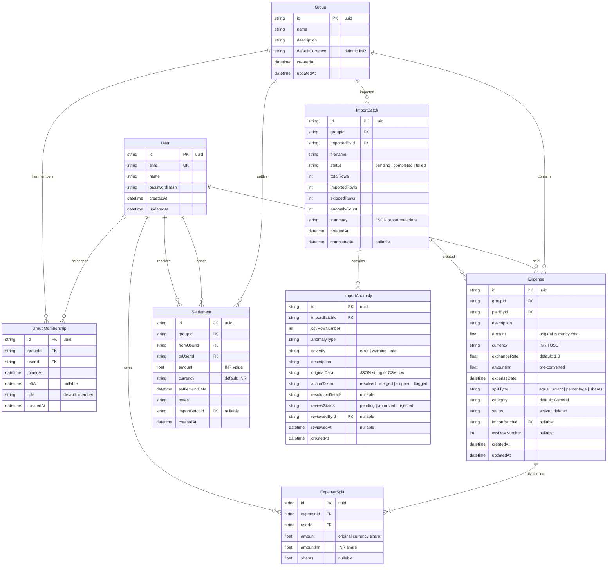

# SCOPE.md — Database Schema & Anomaly Log

This document outlines the database schema design and details the specific data anomalies discovered in `expenses_export.csv` along with our programmatic resolution policies.

---

## 1. Database Schema Design

We use a relational database structure (SQLite for local development, PostgreSQL for production deployment) managed via Prisma ORM.

### Entity Relationship Diagram

### Schema Rationale & Key Tables

1. **`GroupMembership` (Timeline Tracker)**
   - Includes `joinedAt` and `leftAt` (nullable) columns.
   - **Sam's request:** When calculating splits, the system looks up memberships active on `Expense.expenseDate`. Since Sam's `joinedAt` is April 15, 2026, he is excluded from March electricity splits.
   - **Meera's request:** Meera's `leftAt` is set to March 31, 2026, automatically excluding her from any splits for expenses dated after March.

2. **`Expense` & `ExpenseSplit` (Auditable Ledger)**
   - Denormalizes `amountInr` and `exchangeRate` at both the parent expense and individual split level.
   - **Priya's request:** Trips in USD store `currency = 'USD'`, the historical `exchangeRate = 83.5` (from the date of payment), and pre-converted `amountInr`.
   - **Rohan's request:** Instead of showing "magic balance numbers", we join `Expense` and `ExpenseSplit` to generate a detailed per-user running ledger (credit/debit history) showing the exact math behind every rupee owed.

3. **`ImportAnomaly` (Auditable Verification Log)**
   - Stores every warning, duplicate, and format discrepancy discovered in the CSV import process.
   - **Meera's request:** Allows interactive review. If an anomaly is approved, it commits with the default resolution policy; if rejected, that row is skipped.

---

## 2. Anomaly Log & Resolution Policies

The CSV file contains several deliberate data problems. Below is our catalog of anomalies and how they are handled.

| # | Anomaly / Data Problem | Detection Logic | Action & Resolution Policy | Severity |
|---|------------------------|-----------------|----------------------------|----------|
| 1 | **Missing Required Fields** | Row has empty cells for `Date`, `Description`, `Amount`, or `Paid By`. | **Policy:** Skip the row. Incomplete entries cannot be resolved safely. Surfaced in the import report. | `error` |
| 2 | **Invalid Date Format** | Date cell is not parseable by ISO or standard Indian (DD/MM/YYYY) formats. | **Policy:** Log date parsing error, try fuzzy regex parsing, fallback to skipping if unresolvable. | `error` |
| 3 | **Negative Amount** | Amount column contains a value `< 0`. | **Policy:** Flag for review. Treat as a refund or offset credit. Calculate the absolute value and reverse the splits. | `warning` |
| 4 | **Non-Numeric Amount** | Amount string contains alphabetic characters or multiple math signs. | **Policy:** Programmatically strip formatting symbols (`$`, `₹`, commas) and parse. Skip if still NaN. | `error` |
| 5 | **Currency treated as Rupee** | Row starts with `$` prefix or mentions "USD"/"dollars" but is written in the main amount column. | **Policy:** Parse as USD. Apply historical conversion rate (₹83.5) to compute `amountInr` instead of treating $1 = ₹1. | `warning` |
| 6 | **Unknown Payer / User** | `Paid By` column name doesn't match any registered or seeded member names. | **Policy:** Use case-insensitive and nickname fuzzy matching (e.g., "aish" $\rightarrow$ Aisha). Skip if no match is found. | `error` |
| 7 | **Future Expense Date** | Expense date is later than the current timestamp. | **Policy:** Flag for review as a potential date entry error. Commit if approved by the user. | `warning` |
| 8 | **Settlement Logged as Expense** | Description contains payment keywords like "settle", "paid back", "UPI to Rohan", "cleared". | **Policy:** Flag and convert from an Expense to a `Settlement` record. This prevents skewing the total group expenditure. | `info` |
| 9 | **Duplicate Rows** | Multiple rows have the exact same date, payer, rounded amount, and similar descriptions. | **Policy:** Flag for review. The UI presents Meera's approval buttons (Approve/Skip). De-duplicate by skipping the rejected duplicate. | `warning` |
| 10 | **Duplicate with Mismatched Cost** | Same date, payer, similar description, but slightly different amounts. | **Policy:** Flag for review. User inspects both rows to verify if they are distinct expenses or a correction. | `warning` |
| 11 | **Inactive Member in Split (Sam)** | Expense date is before Sam's `joinedAt` (April 15), but he is a participant. | **Policy:** Exclude Sam from the split, distribute his share equally among the active members, and recalculate. | `warning` |
| 12 | **Inactive Member in Split (Meera)** | Expense date is after Meera's `leftAt` (March 31), but she is a participant. | **Policy:** Exclude Meera from the split, distribute her share equally among active members, and recalculate. | `warning` |
| 13 | **Rounding Split Discrepancy** | Sum of individual exact splits does not match the parent total amount (off by a few paise). | **Policy:** Detect difference, adjust the remaining fractional difference (e.g. 1-2 paise) on the payer's split to keep total exact. | `warning` |
